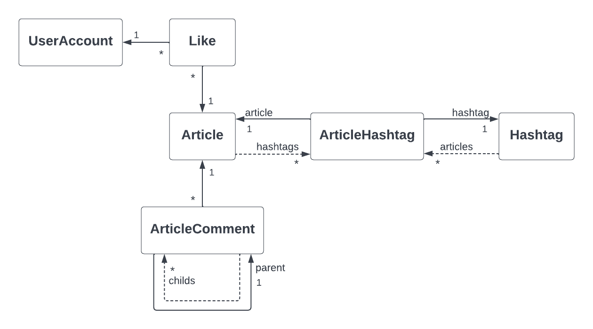
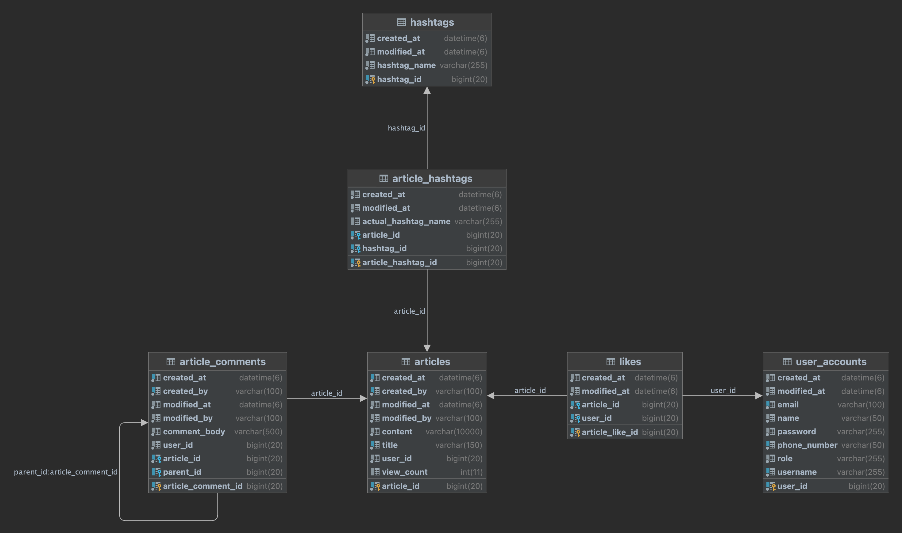

# 게시판 서비스 project-board

Spring Boot와 관련 기수들, JPA, Thymeleaf etc. 로 구현한 게시판 서비스

## 요구사항 및 상세 기능 

- 인증 기능
    - 로그인
    - 로그아웃
- 회원 기능
    - 회원가입
    - 내 정보 조회
    - 내 정보 수정
- 게시글 기능
    - 게시글 작성
    - 게시글 수정
    - 게시글 삭제
    - 게시글 ‘좋아요’
    - 게시글 조회 - 조회수 증가
- 댓글 기능
    - 게시글에 댓글 작성
    - 댓글 삭제
    - 게시글에 해당하는 댓글 리스트 조회
- 게시판 기능
    - 전체 게시글 조회
    - 전체 게시글 검색 (작성자, 제목, 해시태그, 작성일(YYYY-MM)) 기능
    - 전체 게시글 페이징, 정렬(최신순, 오래된순, 제목 사전순, 조회수 높은순) 기능
- 해시태그 기능
    - 전체 해시태그 리스트 조회
    - 해시태그 관련 게시글 리스트 조회
    - 해시태그 검색 기능

## 개발환경

* IntelliJ Ultimate 2022.03
* Java 11
* Gradle 7.5
* Spring Boot 2.7.7

## 세부 기술 스택 

Spring Boot

* Spring Boot Actuator
* Spring Web
* Spring Data JPA
* Thymeleaf
* Spring Security
* H2 Database
* MariaDB Driver
* Lombok
* Spring Boot DevTools
* Spring Validation

그 외 

* Summernote Editor
* Querydsl
* Mapstruct
* AWS S3
* Redis

## ERD

## Feature List
(작성중)

## Results
(작성중)
